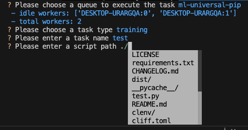

# clenv - Unofficial ClearML CLI helper


## Pre-requisites

- `clearml` installed, please refer to [ClearML installation guide](https://clear.ml/docs/latest/docs/getting_started/ds/ds_first_steps) for more details.
- Run `clearml-init` and initialize your first ever config file.


## Installation

```bash
pip install clenv
```


## Usage

### Subcommand `config`
Note: All config files must be in the format of `clearml-<profile_name>.conf`

#### List all config profiles
```bash
clenv config list
```

#### Create a new config profile
```bash
clenv config create <profile_name>
```

#### Delete a config profile
```bash
clenv config del <profile_name>
```

#### Switch to a config profile
```bash
clenv config checkout <profile_name>
```

#### Reinitialize the `api` section of a config
```bash
clenv config reinit <profile_name>
# Please paste your multi-line configuration and press Enter:
```
Then paste your multi-line configuration generated through clearML server.

### Subcommand `user`

#### Generate user/password hocon config
```bash
clenv user genpass <user_name>
```

### Subcommand `task`

> Note: This command only support git repos for now. The project name of the task created on the ClearML server will be the same as the git repo name. So please make sure you have a meaningful, easy to read git repo name.

#### Execute a task remotely on ClearML server

```bash
clenv task exec
```

It will prompt you to select an available queue, correct task type, your entrypoint script path and input the task name.



After inputting all the required configs, it will ask you whether to save the configs. By typing 'y', the config will be saved. When you execute `clenv task exec` next time in the same repo, it will load the saved configs and skip the config input process. However, it will still ask you for confirmation before submitting the task.

#### Ignore the saved run configs when starting a new execution

If you want to ignore the old run configs and freshly start a new execution, you can run:

```bash
clenv task exec -N
```

The `-N` option will tell `clenv` to ignore the config file you have, and prompt you to input all the configs again.

An alternative way of doing that is to delete the config file manually, which is located at `./.clenv/task_template.json`. Then running `clenv task exec` again will start a fresh execution as well.

## Examples

### Create a new clearml config profile for privately hosted clearml server 

#### Initialize profiles

```bash
$ clenv config list
# Input a name for your current profile
```

#### Create a new profile

```bash
$ clenv config create brainco
```

#### Reinit the profile credentials

```bash
$ clenv config reinit brainco
```

#### Checkout the new profile

```bash
$ clenv config checkout brainco
```

## Roadmap
- Config management
  - [x] Config profile management
  - [ ] Support custom config file path
- Privately hosted server management
  - [x] BCrypt password generation (Feature to be deprecated when more sophisticated user management is implemented)
  - [ ] Server side utils and config management
  - [ ] ClearML Agent side utils and config management
- Remote task management
  - [x] A user friendly remote task execution wizard


## Disclaimer & License
This project is not affiliated with Allegro AI, Inc. in any way. It is an independent and unofficial software. It's licensed under the MIT license.